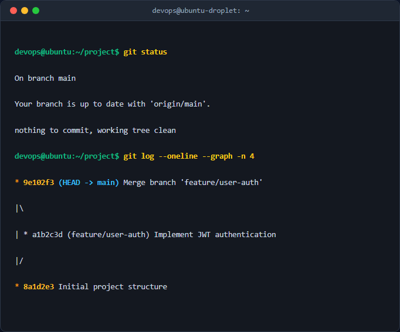

# Bai 5: Chan doan va xu ly xung dot cong mang (Address Already in Use)

## Gioi thieu
Thuc hanh chan doan va giai quyet loi xung dot cong ket noi (`Address already in use`) tren he thong Linux khi deploy ung dung Spring Boot.

## Chuc nang
- Gia lap xung dot cong 8082 bang tien trinh ngam (`python3 -m http.server`).
- Chan doan PID chiem dung cong bang `ss` / `lsof`.
- Giai phong cong bang lenh `kill`.
- Tu dong hoa quy trinh sua loi qua kich ban Bash `solve.sh`.

## Huong dan su dung
1. Cap quyen thuc thi cho script:
   ```bash
   chmod +x solve.sh
   ```
2. Chay kich ban xu ly:
   ```bash
   ./solve.sh
   ```
3. Xem bao cao chi tiet trong file `troubleshoot_report.md`.


## Ảnh chụp màn hình kết quả thực nghiệm

